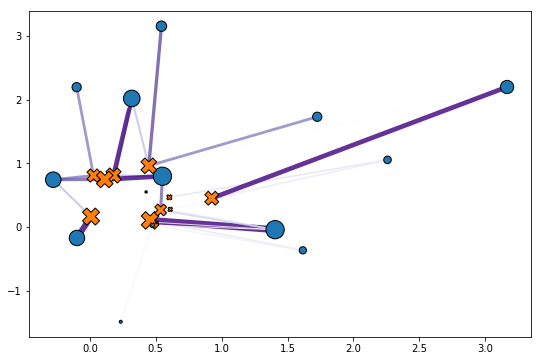

# Optimal Transport Tools (OTT)

**Disclaimer: this is not an official Google product.**

**Disclaimer: this is still under heavy development, the API is likely to change in places.**

OTT is a JAX toolbox that bundles a few utilities to solve [optimal transport problems](https://arxiv.org/abs/1803.00567). These tools can help you compare
and match (in a loose sense) two weighted point clouds (or histograms, or measures, etc.) using a cost or a distance between the points contained in these point clouds.

Our focus in OTT is to provide a sturdy, versatile and efficient implementation of the Sinkhorn algorithm, while taking advantage of JAX features, such as [JIT](https://jax.readthedocs.io/en/latest/notebooks/quickstart.html#Using-jit-to-speed-up-functions) and [auto-vectorization](https://jax.readthedocs.io/en/latest/notebooks/quickstart.html#Auto-vectorization-with-vmap).

An OT problem has two important ingredients: a pair
of weight vectors `a` and `b` (one for each measure) and a ground cost (typically a pairwise cost matrix between the points contained in each measure). OTT encapsulates the ground cost (and several operations attached to it) in a `Geometry` object. The most common geometry is that of two point clouds compared with the squared Euclidean distance, as used in the example below:

## Example

```
import jax
from ott.core.ground_geometry import pointcloud
from ott.core import sinkhorn

# Samples two point clouds and their weights.
rngs = jax.random.split(jax.random.PRNGKey(0),4)
n, m, d = 12, 14, 2
x = jax.random.normal(rngs[0], (n,d)) + 1
y = jax.random.uniform(rngs[1], (m,d))
a = jax.random.uniform(rngs[2], (n,))
b = jax.random.uniform(rngs[3], (m,))
a, b  = a / np.sum(a), b / np.sum(b)

# Computes the couplings via Sinkhorn algorithm.
geom = pointcloud.PointCloudGeometry(x,y)
out = sinkhorn.sinkhorn(geom, a, b)
P = geom.transport_from_potentials(out.f, out.g)
```

One can then plot the transport and obtain something like:



As can be seen above, the sinkhorn algorithm will operate on that `Geometry`,
taking into account weights `a` and `b`, to output a named tuple that contains among other things two potentials `f` and `g` (vectors of the same respective size as `a` and `b`), as well as `reg_OT_cost`, the objective of the regularized OT problem.

## Overall description of source code

Currently implements the following classes and functions:

-   In the [core](ott/core) folder,

    -   The `Geometry` class in [geometry.py](ott/core/ground_geometry/geometry.py) and its descendants describe a cost structure
        between the supports of a pair of input/output measures. That cost
        structure is accessed through various member functions, mostly used when
        running the Sinkhorn algorithm (typically kernel multiplications, or
        log-sum-exp row/column-wise application) or after (to apply the OT
        transport matrix to a vector).

        -   In its generic `Geometry` implementation, the class is initialized
            with a `cost_matrix` or a `kernel_matrix`, as well as a `epsilon`
            regularization parameter or scheduler.

        -   If one wishes to compute OT between two weighted point clouds
             and  endowed with a
            given cost function (e.g. Euclidean) , the `PointCloudGeometry`
            class can be used to define how the corresponding kernel
            .

        -   Simlarly, if all measures to be considered are supported on a
            separable grid (e.g. ), and the cost is separable
            along the various axis, i.e. the cost between two points on that
            grid is equal to the sum of (possibly  different) cost
            functions evaluated on each of the  pairs of coordinates, then
            the application of the kernel is much simplified, both in log space
            or on the histograms themselves.

    -   The `sinkhorn` function in [sinkhorn.py](ott/core/sinkhorn.py) runs the Sinkhorn algorithm, with the aim of
        solving approximately one or various optimal transport problems in
        parallel. An OT problem is defined by a `Geometry` object, and a pair
         (or batch thereof) of histograms. The function's outputs are
        stored in a `SinkhornOutput` named t-uple, containing potentials,
        regularized OT cost, sequence of errors and a convergence flag. Such
        outputs (with the exception of errors and convergence flag) can be
        differentiated either through backprop or implicit differentiation.

    -   The `sinkhorn_divergence` function in [sinkhorn_divergence.py](ott/core/sinkhorn_divergence.py), implements the
        [Sinkhorn divergence](http://proceedings.mlr.press/v84/genevay18a.html),
        a variant of the Wasserstein distance that uses regularization and is
        computed by centering the output of `sinkhorn` when comparing two
        measures.

-   In the [tools](ott/tools) folder,

    -   In [discrete_barycenter.py](ott/tools/discrete_barycenter.py): implementation of discrete Wasserstein
        barycenters : given  histograms all supported on the same
        `Geometry`, compute a barycenter of theses measures, using an algorithm
        by [Janati et al. (2020)](https://arxiv.org/abs/2006.02575)

    -   In [soft_sort.py](ott/tools/soft_sort.py): implementation of
        [soft-sorting](https://papers.nips.cc/paper/2019/hash/d8c24ca8f23c562a5600876ca2a550ce-Abstract.html)
        operators .
